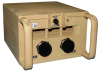

Power Management Unit 
=====================

Power Management Unit SDK for unstable supply source.

It manages all registered devices sleeping mode according to their individual
power level threshold.

## Usage ##

If the power level of the environment is lower than the threshold it makes
a device sleep. If the power level is equal or over the threshold, it wakes
up a device.

First thing is to register every device. An implementation of the Sleepable 
interface for every device is required. Examples here [mocks/sleepable](mocks/sleepable).

The most advanced use cases are shown as test scenarios in this test group
module [test/powermu/BalanceTest.cpp](test/powermu/BalanceTest.cpp).

## Example of use ##

I have a sensor with a Wi-Fi communication module requires up to 150-300mAh, 
and the microcontroller with the sensor require less than 50mA. 

The battery gets drawn during a few concurrent cloudy days because the charger 
is based on solar PV panels, because every time I read the sensor I send a report
to the backend through the Wi-Fi network.

With this Power Management Unit I can disable the Wi-Fi communication module when
the power level is under 50% for example. I'm keeping the sensor readings 
until a few sunny hours charge my battery at least 50%, and then I'm sending all
kept reports together to the backend.

## Thanks ##

My C programming journey is based on this book 
[Test-Driven Development for Embedded C by James W. Grenning](https://pragprog.com/titles/jgade/test-driven-development-for-embedded-c/).
A great book to learn much more than advanced C programming.

## License ##

GNU General Public License (GPLv3). Read the attached [license file](LICENSE.txt).

## Author ##

Jaume Mila Bea <jaume@westial.com>

